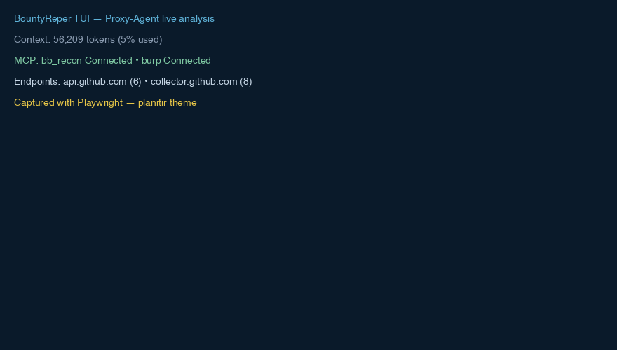

<h1 align="center">Bounty Reaper</h1>
<h3 align="center">The open-source AI agent for offensive security.</h3>

<p align="center">

<p align="center">
  
</p>

<h3 align="center">The open-source AI agent for offensive security.</h3>

<p align="center">
  Automated pentesting from your terminal — your LLM subscription + BountyReaper's security intelligence = autonomous red team.
</p>

<p align="center">
  <a href="#quick-start">Quick Start</a> •
  <a href="#use-cases">Use Cases</a> •
  <a href="#agents">Agents</a> •
  <a href="#mcpbrowser">MCPBrowser</a> •
  <a href="#installation">Installation</a> •
  <a href="./docs/SETUP.md">Docs</a>
</p>

<p align="center">
  <a href="https://github.com/node011/Bounty-Reaper/stargazers"></a>
  <a href="https://github.com/node011/Bounty-Reaper/releases"></a>
  <a href="https://github.com/node011/Bounty-Reaper/actions/workflows/publish.yml"></a>
  <a href="https://github.com/node011/Bounty-Reaper/blob/main/LICENSE"></a>
</p>

---

---

### Quick Start

```bash
git clone https://github.com/node011/Bounty-Reaper.git
cd Bounty-Reaper
./script/bootstrap.sh
bun dev
```

`bootstrap.sh` checks prerequisites (bun 1.3+, uv, git), installs deps, sets up MCP servers, and fetches Chromium. `bun dev` launches the TUI — connect your LLM provider and start testing. Tell it what to test; it handles recon, discovery, exploitation, and reporting.

> Already have an LLM subscription? BountyReaper sits on top of your existing subscription. No extra API costs.

Full setup notes, MCP server configuration and troubleshooting: **[docs/SETUP.md](./docs/SETUP.md)**

---

### What Is BountyReaper?

An intelligence layer that turns any LLM (GPT, Gemini, 200+ providers via models.dev, or local Ollama) into a security specialist. It injects OWASP WSTG methodology, vulnerability patterns, and tool orchestration into every interaction — so the model follows proven pentest frameworks instead of guessing. 13+ specialized agents, 900+ MITRE techniques, 120+ WSTG cases, 6,600+ CIS/NIST controls.

---

### Agents

Switch with `Tab`. Each is a domain specialist:

| Agent | Focus |
|-------|-------|
| **bountyreaper** | Primary — recon, exploitation, reporting |
| **web-application** | OWASP Top 10, WSTG, API, session testing |
| **mobile-application** | Android/iOS, Frida, MASTG/MASVS |
| **cloud-security** | AWS/Azure/GCP — IAM, CIS benchmarks |
| **internal-network** | AD, Kerberos, lateral movement |

Plus 8 proxy testers that run on intercepted traffic (IDOR, authz bypass, mass assignment, injection, auth, business logic, SSRF, file attacks) — 3-gate confirmation, no speculation.

---

### Use Cases

**Bug Bounty Hunting** — Scope a program (`*.target.com`), let recon-hunter map subdomains, tech stack, and exposed secrets; proxy testers find IDOR/SSRF/XSS while you focus on chains. Consistent WSTG methodology across programs, even at 3am.

**Penetration Testing** — Automate the repetitive: port scanning, directory brute force, vulnerability triage. Keep human intuition for creative chains. Generate reports mapped to OWASP/MITRE for clients.

**Security Team Assessments** — Run structured assessments with reproducible methodology. Track coverage per asset, chain low-severity findings into critical paths, export evidence for compliance.

**Continuous Security** — Deploy Bolt on remote servers for network-positioned testing; run BountyReaper offline with Ollama for air-gapped environments.

**Learning & Training** — New to pentesting? Agents explain each step, link to WSTG/CWE, and show PoCs. Learn by watching the agent work.

---

### MCPBrowser

MCPBrowser is the built-in Chromium browser. Start it with `/mcpbrowser` in the TUI or `bountyreaper mcpbrowser https://target.com`:

```bash
bountyreaper mcpbrowser https://target.com --scope "*.target.com" --steps 50
```

Every request is intercepted and routed through the 8 proxy testers. Two modes: **manual** (browse as different users, trigger features) and **autonomous** (provide credentials, let it crawl and compare roles). Use `--scope` to limit testing, `--credential hunter1` for role-based crawling.

*`hackbrowser` still works as an alias.*

```
Browser traffic → Proxy intercept → Orchestrator → 8 sub-testers (parallel)
```

---

### Installation

**Clone and build — only supported method:**

```bash
git clone https://github.com/node011/Bounty-Reaper.git
cd Bounty-Reaper
./script/bootstrap.sh
bun dev
```

Or build a binary:

```bash
cd packages/bountyreaper && bun run build && cd ../..
./install --binary packages/bountyreaper/dist/bountyreaper-darwin-arm64/bin/bountyreaper
# installs to ~/.bountyreaper/bin, `bountyreaper --version` works anywhere
```

Details: **[docs/SETUP.md](./docs/SETUP.md)**

---

### Web UI & Bolt

`bountyreaper web` — full browser UI for chat, MCP status, and findings. Tunnel via Cloudflare for remote access (`cloudflared tunnel --url http://localhost:4096`).

Bolt — run tools on remote servers over MCP with Ed25519 auth. One TUI, many Bolt servers.

---

### Contributing

Contributions welcome — agents, skills, MCP servers, knowledge base, or core improvements. See [CONTRIBUTING.md](./CONTRIBUTING.md) and [CODE_OF_CONDUCT.md](./CODE_OF_CONDUCT.md) (authorized testing only).

---

### License

[MIT](./LICENSE), except [`.bountyreaper/skill/CIS_benchmarks/`](./.bountyreaper/skill/CIS_benchmarks/) which is [CC BY-NC-SA 4.0](https://creativecommons.org/licenses/by-nc-sa/4.0/) — NonCommercial.

Derived from [opencode](https://github.com/anomalyco/opencode) (MIT). See [NOTICE](./NOTICE).

---

<p align="center">
  <a href="https://x.com/bountyreaperio"><b>X.com</b></a> · <a href="https://github.com/node011/Bounty-Reaper"><b>GitHub</b></a>
</p>
