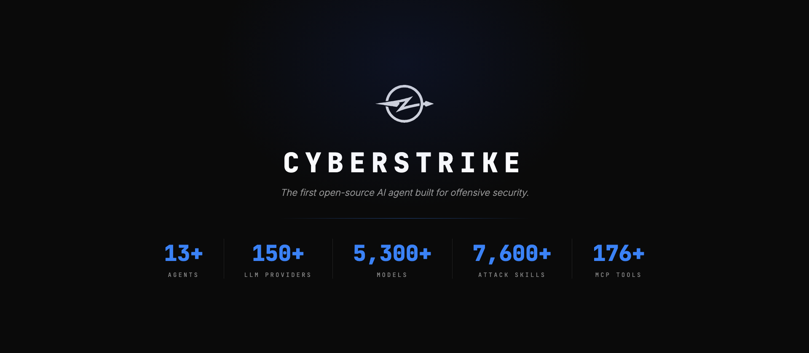

<p align="center">
  <a href="README.md">English</a> |
  <a href="README.zh.md">简体中文</a> |
  <a href="README.zht.md">繁體中文</a> |
  <a href="README.ko.md">한국어</a> |
  <a href="README.de.md">Deutsch</a> |
  <a href="README.es.md">Español</a> |
  <a href="README.fr.md">Français</a> |
  <a href="README.it.md">Italiano</a> |
  <a href="README.da.md">Dansk</a> |
  <a href="README.ja.md">日本語</a> |
  <a href="README.pl.md">Polski</a> |
  <a href="README.ru.md">Русский</a> |
  <a href="README.bs.md">Bosanski</a> |
  <a href="README.ar.md">العربية</a> |
  <a href="README.no.md">Norsk</a> |
  <a href="README.br.md">Português (Brasil)</a> |
  <a href="README.th.md">ไทย</a> |
  <a href="README.tr.md">Türkçe</a> |
  <a href="README.uk.md">Українська</a> |
  <a href="README.bn.md">বাংলা</a> |
  <a href="README.el.md">Ελληνικά</a> |
  <a href="README.vi.md">Tiếng Việt</a> |
  <a href="README.hi.md">हिन्दी</a>
</p>

<p align="center">
  <picture>
    <source media="(prefers-color-scheme: dark)" srcset="assets/hero-dark.webp">
    <source media="(prefers-color-scheme: light)" srcset="assets/hero-light.webp">
    
  </picture>
</p>

<h3 align="center">The first open-source AI agent built for offensive security.</h3>

<p align="center">
  Automated penetration testing from your terminal — plug in your Claude, GPT, or any LLM subscription<br>
  and turn it into an autonomous red team agent with 13+ specialized agents, 7,600+ security skills, and 120+ OWASP test cases.<br>
  <b>150+ AI providers</b> &bull; <b>5,300+ models</b> &bull; <b>56+ built-in tools</b> &bull; <b>176+ MCP tools</b>
</p>

<p align="center">
  <a href="#quick-start">Quick Start</a> &bull;
  <a href="#intelligence-layer">Intelligence Layer</a> &bull;
  <a href="#what-makes-it-different">What Makes It Different</a> &bull;
  <a href="#agents">Agents</a> &bull;
  <a href="#security-skills">Skills</a> &bull;
  <a href="#web-ui--remote-access">Web UI</a> &bull;
  <a href="#bolt--remote-tool-execution">Bolt</a> &bull;
  <a href="#mcp-ecosystem">MCP Ecosystem</a> &bull;
  <a href="#post-exploitation">Post-Exploitation</a> &bull;
  <a href="#installation">Installation</a> &bull;
  <a href="https://docs.bountyreper.io">Docs</a> &bull;
  <a href="https://bountyreper.io">Website</a>
</p>

<p align="center">
  <a href="https://github.com/node011/Bounty-Reper/stargazers"></a>
  <a href="https://github.com/node011/Bounty-Reper/releases"></a>
  <a href="https://github.com/node011/Bounty-Reper/actions/workflows/publish.yml"></a>
  <a href="https://discord.gg/snunAaHf6U"></a>
  <a href="https://github.com/node011/Bounty-Reper/blob/main/LICENSE"></a>
</p>

---

### Quick Start

```bash
git clone https://github.com/node011/Bounty-Reper.git
cd Bounty-Reper
./script/bootstrap.sh
bun dev
```

BountyReper is installed by cloning and building — there is no package on npm, Homebrew or Scoop. `bootstrap.sh` checks your prerequisites, installs dependencies, sets up the bundled MCP servers in isolated environments, fetches Chromium, and registers the servers so they load in every folder. It is idempotent, so re-run it after a `git pull`.

`bun dev` launches the TUI, asks for your LLM provider and API key on first run, and you're ready. Tell it what to test — it handles reconnaissance, vulnerability discovery, exploitation, and reporting.

**Prerequisites:** [bun](https://bun.sh) 1.3+, [uv](https://docs.astral.sh/uv/), and git. Bootstrap stops with instructions if any are missing.

> **Already have a Claude Code or OpenAI subscription?** BountyReper's intelligence layer sits on top of your existing AI subscription. No separate API costs — your current plan powers an entire pentest toolkit.

Explore the full documentation at **[docs.bountyreper.io](https://docs.bountyreper.io)** or visit **[bountyreper.io](https://bountyreper.io)** for demos and guides.

---

### Intelligence Layer

BountyReper isn't just a wrapper around an LLM. It's an intelligence layer that transforms any AI model into an offensive security specialist.

**How it works:** When you connect your LLM provider, BountyReper injects domain-specific context — OWASP testing methodology, vulnerability patterns, attack chain reasoning, and tool orchestration logic — into every interaction. The model doesn't need to know security; BountyReper teaches it.

**What the intelligence layer provides:**

- **Schema normalization** — Structured output from any provider, regardless of response format differences
- **Context guard** — Prevents prompt leakage and keeps the agent focused on the current test phase
- **Provider auto-detection** — Automatically identifies your LLM endpoint and configures the optimal transport
- **Tool orchestration** — Chains security tools intelligently based on findings, not fixed scripts

**150+ AI providers and 5,300+ models supported out of the box:**

BountyReper integrates with the entire AI ecosystem through 23 bundled SDK providers and 150+ providers via the [models.dev](https://models.dev) catalog. Here are the core integrations:

| Provider                  | Models                   | Notes                                   |
| ------------------------- | ------------------------ | --------------------------------------- |
| **Anthropic**             | Claude 4.5, Claude 4     | Best performance with extended thinking |
| **OpenAI**                | GPT-5, GPT-4.1, o3, o4   | Full tool-use + reasoning support       |
| **Google**                | Gemini 2.5 Pro/Flash     | Long context for large codebases        |
| **Amazon Bedrock**        | All Bedrock models       | IAM auth, no API keys needed            |
| **Azure OpenAI**          | All Azure-hosted models  | Enterprise deployments                  |
| **Google Vertex AI**      | Gemini + Claude on GCP   | Regional endpoints (EU/US)              |
| **GitHub Copilot**        | GPT-5, Claude, Gemini    | Use your existing Copilot subscription  |
| **xAI**                   | Grok 3, Grok 3 Mini      | Real-time data access                   |
| **Groq**                  | LLaMA, Mixtral           | Ultra-fast inference                    |
| **Mistral**               | Mistral Large, Codestral | European data residency                 |
| **DeepSeek**              | DeepSeek V3, R1          | Cost-effective alternative              |
| **Cerebras**              | LLaMA on Cerebras        | Fastest inference available             |
| **Cohere**                | Command R+               | RAG-optimized models                    |
| **OpenRouter**            | 300+ models              | Single API, any model                   |
| **Together AI**           | Open-source models       | Fine-tuning support                     |
| **DeepInfra**             | Open-source models       | Pay-per-token, no GPU needed            |
| **Perplexity**            | Sonar models             | Search-augmented generation             |
| **Alibaba Cloud**         | Qwen, Kimi, DashScope    | Chinese model ecosystem                 |
| **Cloudflare AI Gateway** | Any provider via gateway | Caching, rate limiting, analytics       |
| **Ollama**                | Any GGUF model           | Fully offline, local-only               |
| **LM Studio**             | Any local model          | Desktop GUI + API server                |
| **vLLM**                  | Any HuggingFace model    | Self-hosted, GPU-optimized              |
| **Any OpenAI-compatible** | —                        | Custom endpoints welcome                |

> **Air-gapped environments?** Run BountyReper entirely offline with Ollama or LM Studio. No data leaves your machine — ever.

---

### What Makes It Different

<table>
<tr>
<td width="50%">

**Specialized Security Agents, Not Generic Chat**

BountyReper ships with 13+ agents purpose-built for security domains. Each agent carries domain-specific methodology, tool knowledge, and testing patterns. The web-application agent follows OWASP WSTG. The cloud-security agent knows CIS benchmarks. The mobile agent uses Frida and follows MASTG/MASVS. They don't guess — they follow proven offensive security frameworks.

</td>
<td width="50%">

**Intelligence Layer, Not Just an LLM Wrapper**

Most AI security tools are thin wrappers that send your prompt to an API. BountyReper's intelligence layer normalizes outputs across 150+ providers and 5,300+ models, guards context between test phases, auto-detects your provider configuration, and orchestrates multi-step attack chains. The result: consistent, methodology-driven pentesting regardless of which model you use.

</td>
</tr>
<tr>
<td width="50%">

**150+ Providers, Zero Lock-in**

Anthropic, OpenAI, Google, Amazon Bedrock, Azure, Groq, Mistral, xAI, DeepSeek, Cerebras, Cohere, OpenRouter, Together AI, GitHub Copilot — or run fully offline with Ollama and LM Studio. 150+ providers, 5,300+ models. You choose the model. You own the results. As AI models get better and cheaper, BountyReper gets better with them. Switch providers in seconds without reconfiguring anything.

</td>
<td width="50%">

**Remote Tool Execution with Bolt**

Your security tools don't have to run on your laptop. Deploy Bolt on one or many remote servers, pair with Ed25519 keys, and control everything from your local terminal. One BountyReper instance can orchestrate dozens of Bolt servers — each with its own toolkit, network position, and attack surface access.

</td>
</tr>
</table>

---

### Agents

Switch between agents with `Tab`. Each one is a domain specialist.

| Agent                  | Focus   | What It Does                                                        |
| ---------------------- | ------- | ------------------------------------------------------------------- |
| **bountyreper**        | General | Full-access primary agent — reconnaissance, exploitation, reporting |
| **web-application**    | Web     | OWASP Top 10, WSTG methodology, API security, session testing       |
| **mobile-application** | Mobile  | Android/iOS, Frida/Objection, MASTG/MASVS compliance                |
| **cloud-security**     | Cloud   | AWS, Azure, GCP — IAM misconfigs, CIS benchmarks, exposed resources |
| **internal-network**   | Network | Active Directory, Kerberos attacks, lateral movement, pivoting      |

Plus **8 specialized proxy testers** that run automatically on intercepted traffic:

| Tester                   | What It Tests                                                                |
| ------------------------ | ---------------------------------------------------------------------------- |
| **IDOR**                 | Object-level access control — can user A reach user B's resources?           |
| **Authorization Bypass** | Vertical privilege escalation — can low-privilege users hit admin endpoints? |
| **Mass Assignment**      | Unexpected writable fields — role, price, balance, userId in request bodies  |
| **Injection**            | SQL, command, LDAP, template injection across all input vectors              |
| **Authentication**       | Token validation, session fixation, credential exposure                      |
| **Business Logic**       | Price manipulation, coupon reuse, race conditions, workflow bypass           |
| **SSRF**                 | Internal host access via user-controlled URLs or redirect parameters         |
| **File Attacks**         | Path traversal, unrestricted upload, dangerous file types                    |

Each tester uses a **3-gate confirmation protocol**: execute a baseline request, execute the attack, compare responses. A finding is only reported when there is a measurable, reproducible difference — not on speculation. Duplicate findings (same endpoint + attack vector) are automatically suppressed across the session.

---

### Security Skills

BountyReper ships with **7,600+ security skill files** — structured, Ed25519-signed methodology documents that give agents deep domain knowledge at runtime. Skills are lazy-loaded (one at a time, on demand) and statically injected into agent prompts.

**Skill categories:**

| Category                  | Skills | What They Cover                                                                                                                                                                            |
| ------------------------- | ------ | ------------------------------------------------------------------------------------------------------------------------------------------------------------------------------------------ |
| **Attack Methodologies**  | 19     | JWT attacks, SSRF, SSTI, race conditions, request smuggling, cache poisoning, CORS, GraphQL, prototype pollution, XXE, WebSocket, subdomain takeover, host header injection, open redirect |
| **Post-Exploitation**     | 5      | AWS, Azure, Kubernetes, Windows, macOS privilege escalation and persistence                                                                                                                |
| **Compliance Frameworks** | 3      | CIS Benchmarks (AWS/Azure/GCP/K8s), NIST Framework, MITRE ATT&CK (Enterprise, Mobile, ICS)                                                                                                 |
| **Domain Knowledge**      | 8+     | Active Directory security, web security patterns, recon methodology, CI/CD attacks, Kerberos attacks, eBPF techniques                                                                      |

Each skill includes testing procedures, payloads, tool commands, and CWE mappings. Skills are tagged with OWASP WSTG IDs, CIS control IDs, and chain relationships — so agents know which skills to combine for multi-step attack chains.

---

### HackBrowser

> Full documentation: **[docs.bountyreper.io/docs/tools/hacker-browser](https://docs.bountyreper.io/docs/tools/hacker-browser/)**

HackBrowser is BountyReper's built-in Chromium browser. Start it from the TUI with `/hackbrowser`. As you browse, every HTTP request is captured and routed through the proxy-agent pipeline — no manual export, no Burp project files.

**Two capture modes:**

- **Manual** — Browse the target yourself. Log in as different users, navigate features, trigger actions. HackBrowser captures the real API traffic behind every click.
- **Autonomous** — Provide credentials for multiple accounts, set a scope, and let HackBrowser crawl automatically. It logs in as each user, maps reachable pages, and captures the traffic difference between roles.

**Role & credential discovery:**

As you browse with multiple accounts, BountyReper builds a session context — a live map of discovered credentials, inferred role hierarchy, and which endpoints each role can reach. The 8 proxy sub-testers use this context directly: they know which token to use for a high-privilege baseline and which lower-privilege credentials to test with, without any manual setup.

```
Browser traffic → Proxy intercept → Orchestrator → 8 sub-testers (parallel)
                                          ↓
                               Session context (credentials, roles,
                               endpoints, functions) shared across all testers
```

**Scope control:**

Use `--scope` to limit testing to specific domains. BountyReper automatically derives the registered domain (e.g. `--scope api.example.com` covers `api.example.com` but not `other.com`). Pass multiple `--scope` flags for multi-domain targets.

---

### Web UI & Remote Access

BountyReper includes a full web interface. Run `bountyreper web` and control your agents, MCP servers, Bolt connections, and vulnerability findings from any browser.

**Access from anywhere with Cloudflare Tunnel:**

```
Browser ──HTTPS──▶ Cloudflare Tunnel ──encrypted──▶ cloudflared (localhost) ──▶ BountyReper Server
```

```bash
export BOUNTYREPER_SERVER_PASSWORD=your-secure-password
bountyreper web
# In another terminal:
cloudflared tunnel --url http://localhost:4096 run your-tunnel
```

**Why this is secure:**

- **Zero open ports** — BountyReper binds to `localhost:4096`. `cloudflared` makes an outbound-only connection to Cloudflare's edge. No firewall rules, no port forwarding needed.
- **End-to-end encryption** — Browser to Cloudflare edge is TLS. Cloudflare edge to your machine is an encrypted tunnel. No plaintext leaves your network.
- **Password-protected API** — Every API request requires Basic Auth. Local requests on `localhost` bypass auth for convenience; remote requests via CF tunnel always require credentials (detects `X-Forwarded-For` / `CF-Connecting-IP`).
- **Your data stays local** — LLM inference runs on your hardware. BountyReper processes everything locally. The tunnel is just a secure pipe.

**What's in the Web UI:**

| Tab                 | What It Does                                                                   |
| ------------------- | ------------------------------------------------------------------------------ |
| **Chat**            | Full conversation with all 13+ security agents                                 |
| **MCP**             | Live MCP server status, health, and tool counts                                |
| **Bolt**            | Bolt remote server connection monitoring                                       |
| **Vulnerabilities** | Discovered vulns with severity, PoC, and impact                                |
| **Web Context**     | Endpoints, roles, credentials, and functions discovered during active sessions |

**[app.bountyreper.io](https://app.bountyreper.io)** is a hosted static page (no backend, no data storage) for convenience. Or self-host: clone the repo and serve `packages/app/dist/` from your own domain.

---

### Bolt — Remote Tool Execution

Bolt is BountyReper's remote tool server. Deploy it on any VPS, cloud instance, or Docker container — then control it from your local terminal over MCP protocol with Ed25519 authentication.

**One BountyReper, many Bolt servers:**

```
                                          ┌─────────────────────┐
                                     ┌───►│  Bolt Server #1     │
                                     │    │  nmap, nuclei, ffuf  │
┌──────────────────┐   MCP + Ed25519 │    └─────────────────────┘
│  Your Terminal   │   over HTTPS    │    ┌─────────────────────┐
│  BountyReper TUI │ ◄─────────────►├───►│  Bolt Server #2     │
│                  │   Tool Results   │    │  sqlmap, burp, zap   │
└──────────────────┘                 │    └─────────────────────┘
                                     │    ┌─────────────────────┐
                                     └───►│  Bolt Server #3     │
                                          │  Custom toolkit      │
                                          └─────────────────────┘
```

- **Deploy anywhere** — VPS, Docker, Kubernetes, or bare metal with pre-built Kali images
- **Ed25519 key pairing** — No passwords, no shared secrets, no attack surface
- **Real-time streaming** — Results flow back to your TUI as they happen
- **Manage from TUI** — Add, remove, and monitor Bolt servers without leaving BountyReper
- **Scale horizontally** — Run heavy scans from servers with better bandwidth while you work locally

---

### MCP Ecosystem

BountyReper connects to specialized MCP servers that extend its capabilities — **176+ security tools** across 5 domains:

| Server                                                                 | Tools | What It Adds                                                         |
| ---------------------------------------------------------------------- | ----- | -------------------------------------------------------------------- |
| [cloud-audit-mcp](https://github.com/badchars/cloud-audit-mcp)         | 38    | Cloud security audits — 60+ checks across AWS, Azure, GCP            |
| [github-security-mcp](https://github.com/badchars/github-security-mcp) | 39    | GitHub security posture — repo, org, actions, secrets, supply chain  |
| [cve-mcp](https://github.com/badchars/cve-mcp)                         | 23    | CVE intelligence — NVD, EPSS, CISA KEV, GitHub Advisory, OSV         |
| [osint-mcp](https://github.com/badchars/osint-mcp)                     | 37    | OSINT recon — Shodan, VirusTotal, SecurityTrails, Censys, DNS, WHOIS |

All open source. All installable with `npx`. Plug them into BountyReper or use them standalone with any MCP-compatible client.

---

### Built-in Tools

BountyReper agents have direct access to **56+ tools** without any external dependencies:

| Category              | Tools                                                                               |
| --------------------- | ----------------------------------------------------------------------------------- |
| **Execution**         | Shell (bash), file read/write/edit/patch, directory listing, batch operations       |
| **Discovery**         | Web fetch, web search, code search, glob, grep, intel gathering                     |
| **Offensive**         | HackBrowser, attack script execution, vulnerability reporting & triage              |
| **Post-Exploitation** | AWS hook, Azure hook, Kubernetes hook, Windows hook, macOS hook, CI/CD pipe, eBPF   |
| **Web Context**       | Session context, endpoint/role/credential/function discovery and management         |
| **Proxy**             | HTTP/HTTPS interception, request replay, session context sharing across sub-testers |
| **Reporting**         | Professional report generation, coverage notes, methodology tracking, VRT checks    |
| **Integration**       | MCP servers, Bolt remote tools, custom plugins, LSP                                 |

Plus a **plugin SDK** with 15+ hook types (tool interception, message transformation, permission prompts, shell environment) — build your own agents and tools, register them at runtime.

---

### Post-Exploitation

BountyReper includes built-in post-exploitation capabilities across multiple platforms — no external tools required.

| Platform       | Capabilities                                                                                                                                                                     |
| -------------- | -------------------------------------------------------------------------------------------------------------------------------------------------------------------------------- |
| **macOS**      | Chrome credential extraction, Keychain dumping, keylogging, TCC bypass, GateKeeper bypass, XProtect checks, SSH key extraction, DTrace system tracing                            |
| **Windows**    | Post-exploitation hooks for privilege escalation and persistence                                                                                                                 |
| **Linux/eBPF** | 29 kernel-level scripts — process execution monitoring, SSL/TLS sniffing, keystroke logging, namespace manipulation detection, rootkit detection, process/file/connection hiding |
| **AWS**        | IAM enumeration, S3 exposure, Lambda backdoors, CloudTrail evasion                                                                                                               |
| **Azure**      | Identity enumeration, storage exposure, function exploitation                                                                                                                    |
| **Kubernetes** | Pod escape, service account abuse, secret extraction, RBAC exploitation                                                                                                          |
| **CI/CD**      | Pipeline injection, secret extraction, build artifact manipulation                                                                                                               |

All post-exploitation tools are agent-driven — they execute based on context and findings, not as fixed scripts.

---

### Installation

**Clone and build. This is the only supported installation method** — BountyReper is not published to npm, Homebrew or Scoop, and there are no release binaries to download.

```bash
git clone https://github.com/node011/Bounty-Reper.git
cd Bounty-Reper
./script/bootstrap.sh
```

Run it straight from the repo:

```bash
bun dev
```

Or build a standalone binary and put it on your `PATH`:

```bash
cd packages/bountyreper && bun run build && cd ../..

# pick the target matching your machine
ls packages/bountyreper/dist/
./install --binary packages/bountyreper/dist/bountyreper-darwin-arm64/bin/bountyreper
```

That installs to `~/.bountyreper/bin`, copies the hackbrowser worker alongside it, and adds the directory to your shell config. `bountyreper --version` should then work from anywhere.

Full setup notes, MCP server configuration and troubleshooting: **[docs/SETUP.md](./docs/SETUP.md)**.

---

### Who Is This For?

- **Pentesters** — Automate the repetitive parts. Let agents handle recon and initial testing while you focus on the creative attack chains that need human intuition.
- **Bug Bounty Hunters** — Faster reconnaissance, wider coverage, consistent methodology across programs. BountyReper doesn't get tired at 3am.
- **Security Teams** — Run structured OWASP assessments with reproducible methodology. Get reports that map to standards your compliance team understands.
- **Security Researchers** — Extend BountyReper with custom agents and MCP servers. The plugin system and MCP protocol make it a platform, not just a tool.

---

### Contributing

BountyReper is built by the security community, for the security community. We welcome contributions across:

- **Security agents and skills** — New attack methodologies, testing patterns, vulnerability detection
- **MCP servers** — Connect new security tools and data sources
- **Knowledge base** — WSTG, MASTG, PTES, CIS methodology guides
- **Core improvements** — Performance, UX, provider integrations, bug fixes

Read the [Contributing Guide](./CONTRIBUTING.md) before submitting a PR. All contributions must follow the project's [ethical use policy](./CODE_OF_CONDUCT.md) — BountyReper is for authorized security testing only.

---

### License

[MIT](./LICENSE), with one exception: [`.bountyreper/skill/CIS_benchmarks/`](./.bountyreper/skill/CIS_benchmarks/) is derived from the CIS Benchmarks and is licensed [CC BY-NC-SA 4.0](https://creativecommons.org/licenses/by-nc-sa/4.0/) — **NonCommercial**. Using those specific compliance skills on a paid engagement needs prior approval from CIS; everything else carries no such restriction, and deleting that directory removes it entirely (nothing depends on it).

BountyReper is derived from [opencode](https://github.com/anomalyco/opencode) (MIT).

See [NOTICE](./NOTICE) for all third-party attributions.

---

### MCP Security Suite

BountyReper is the core platform. These MCP servers extend its capabilities:

| Project                                                                | Domain                                  | Tools                                                       |
| ---------------------------------------------------------------------- | --------------------------------------- | ----------------------------------------------------------- |
| **BountyReper**                                                        | **Autonomous offensive security agent** | **13+ agents, 56+ tools, 7,600+ skills, 150+ AI providers** |
| [cloud-audit-mcp](https://github.com/badchars/cloud-audit-mcp)         | Cloud security (AWS/Azure/GCP)          | 38 tools, 60+ checks                                        |
| [github-security-mcp](https://github.com/badchars/github-security-mcp) | GitHub security posture                 | 39 tools, 45 checks                                         |
| [cve-mcp](https://github.com/badchars/cve-mcp)                         | Vulnerability intelligence              | 23 tools, 5 sources                                         |
| [osint-mcp](https://github.com/badchars/osint-mcp-server)              | OSINT & reconnaissance                  | 37 tools, 12 sources                                        |

---

<p align="center">
  <a href="https://bountyreper.io"><b>bountyreper.io</b></a> · <a href="https://docs.bountyreper.io"><b>Docs</b></a> · <a href="https://discord.gg/snunAaHf6U"><b>Discord</b></a> · <a href="https://x.com/bountyreperio"><b>X.com</b></a> · <a href="https://github.com/node011/Bounty-Reper"><b>GitHub</b></a>
</p>
<p align="center">
  <sub>Built by hackers who got tired of copy-pasting between terminals.</sub>
</p>
